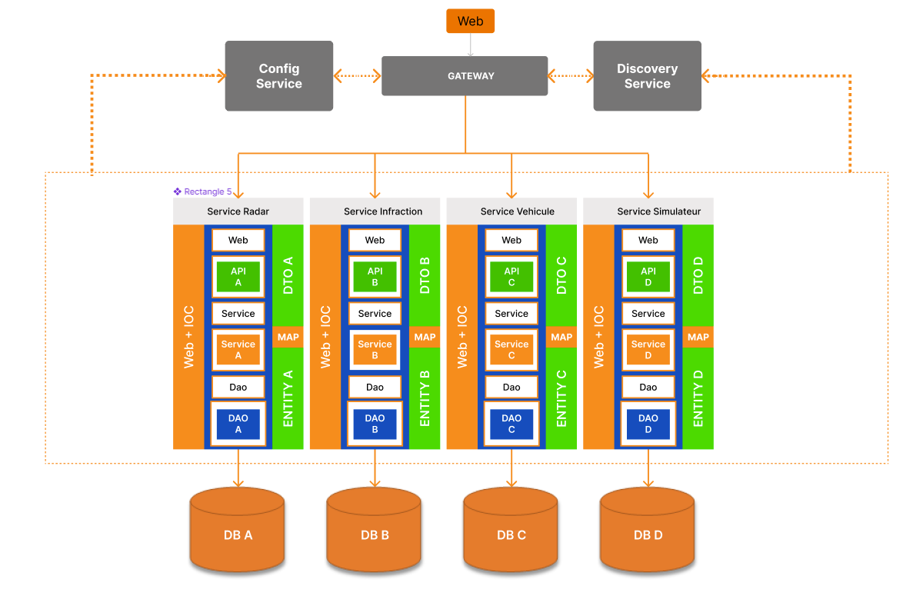
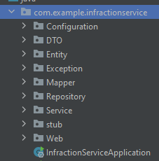
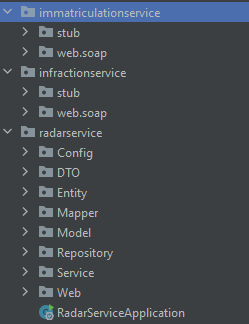
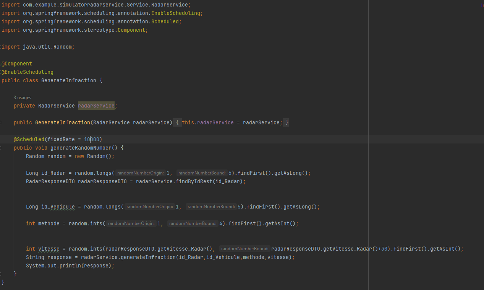
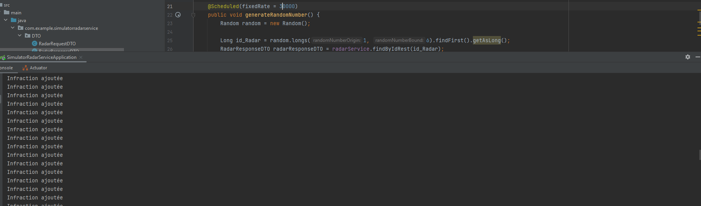
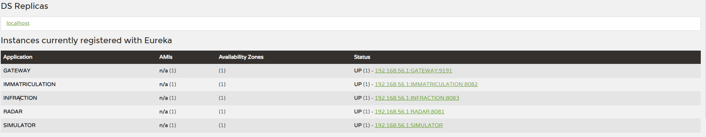
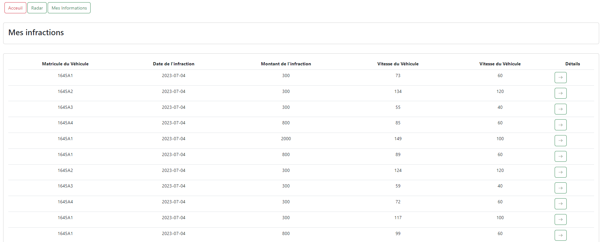

<h1>Compte rendu du projet Gestion des infractions</h1>

Ce projet consiste a crée un système qui gére les infractions des véhicules, qui doit être crée sous une architecture en micro service

Cette architecture est composée:

<ul>
    <li>Un service Radar</li>
    <li>Un service Immatriculation</li>
    <li>Un service Infraction</li>
    <li>Un service Simulateur de radar</li>
    <li>Gateway</li>
    <li>Eureka Service</li>
</ul>

<h3>Chaque micro service suit les bonnes pratiques</h3>
<ul>
    <li>Couche DTO</li>
    <li>Couche Entity</li>
    <li>Couche Exception</li>
    <li>Couche Configuration</li>
    <li>Couche Mapper</li>
    <li>Couche Repository</li>
    <li>Couche Service</li>
    <li>Couche Web</li>
</ul>

Dans les micro service infraction et immatriculation il y a 4 type de connecteurs

<ul>
    <li>Rest API</li>
    <li>GraphQl</li>
    <li>SOAP</li>
    <li>GRPC</li>
</ul>

Pour le micro service Radar, ce dernier agis comme client avec les autre micro service

<h3>Pour le micro service simulateur</h3>

Ce dernier embrque une fonction qui s'execute chaque 30 secondes, cette derniere
genere un id aléatoire d'un radar existant, d'un vehicule et d'une vitesse de vehicule aléatoire et d'une m"thode d'envoie(Rest,GraphQL,SOAP et GRPC)
puis envoie ces informations au micro service radar grace à graphQL qui lui ajoute une infraction dans le micro service infraction selon le type de méthode selectionnée aléatoirement

<h5>Output du simulator</h5>

Quand une infraction est ajouté un message s'affiche

<h2>Architecture</h2>

nous avons crée la gateway et eureka service pour rassembler tous les services

<h3>Angular</h3>

Nous avons créer un design grace à bootstrap juste pour illustrer les résultats du backend

